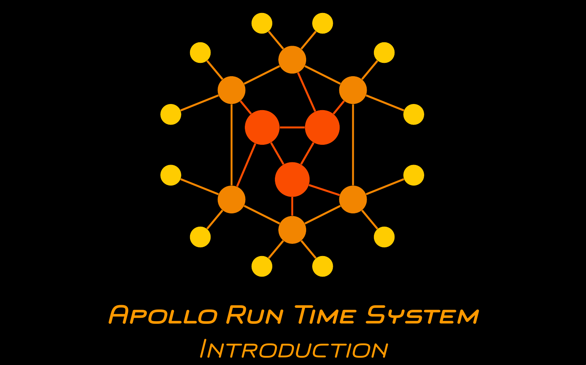

# Apollo-Core

Welcome to the documentation of the Apollo-Core Github organization.

---------------------------------------------------

## ApolloWf Project

The Apollo-Core organization is part of the [ApolloWf](https://apollowf.github.io/) project of the [distributed and parallel systems group](http://dps.uibk.ac.at/) of the University of Innsbruck, Austria. The purpose of this open-source project is to enable the execution of complex applications using serverless functions which are distributed across cloud, edge, and IoT resources. At the core of this project is the **Apollo Runtime System** which orchestrates and optimizes the execution of the application. This GitHub organization (Apollo-Core) contains the source code of the fundamental parts of this runtime system.

-----------------------------------

## Getting Started

A short introduction of Apollo's purpose and its focus user group is provided in the following video (click the image):

A brief guide to quickly set up a running orchestration is provided in the [EE-Demo](https://github.com/Apollo-Core/EE-Demo) repository.

----------------------------

## Organization Overview

The Apollo-Core organization consists of 13 repositories:

- [EE-Core](https://github.com/Apollo-Core/EE-Core) - main interfaces shared across the other repositories
- [EE-Guice](https://github.com/Apollo-Core/EE-Guice) - [google guice](https://github.com/google/guice) modules used for dynamic dependency injection
- [EE-Model](https://github.com/Apollo-Core/EE-Model) - graph-based system model used to represent the application and the available resources
- [EE-IO](https://github.com/Apollo-Core/EE-IO) - definition of the input file format, parsers for the input files ([AFCL](https://apollowf.github.io/learn.html) among others) used to generate the system model
- [EE-Enactables](https://github.com/Apollo-Core/EE-Enactables) - atomic units of execution such as serverless function triggers or control- and data flow constructs
- [SC-Core](https://github.com/Apollo-Core/SC-Core) - interfaces for schedulers used during the orchestration
- [EE-Control](https://github.com/Apollo-Core/EE-Control) - main components controlling the orchestration at runtime
- [EE-Visualization](https://github.com/Apollo-Core/EE-Visualization) - (real-time) visualization of the system model throughout the orchestration
- [EE-Docker](https://github.com/Apollo-Core/EE-Docker) - execution of application functions in local Docker containers
- [EE-Deploy](https://github.com/Apollo-Core/EE-Deploy) - infrastructure for deploying Apollo as an orchestration (web) service
- [EE-Demo](https://github.com/Apollo-Core/EE-Demo) - simple applications for demonstration purposes
- [IntegrationTests](https://github.com/Apollo-Core/IntegrationTests) - integration tests used for the CI workflows
- [RepositoryConfiguration](https://github.com/Apollo-Core/RepositoryConfiguration) - style for the code format, code quality rules applied during the CI checks

------------------------------

## Versioning

The following table provides the currently stable versions of the organization repositories:

Repository | Most Recent Stable Version | gradle dependency
-----------|----------------------------|------------------
[EE-Core](https://github.com/Apollo-Core/EE-Core) | 1.0.1 | implementation 'com.github.Apollo-Core:EE-Core:v1.0.1'
[EE-Guice](https://github.com/Apollo-Core/EE-Guice) | 1.0.2 | implementation 'com.github.Apollo-Core:EE-Guice:v1.0.2'
[EE-Model](https://github.com/Apollo-Core/EE-Model) | 1.0.2 | implementation 'com.github.Apollo-Core:EE-Model:v1.0.2'
[EE-IO](https://github.com/Apollo-Core/EE-IO) | 1.0.2 | implementation 'com.github.Apollo-Core:EE-IO:v1.0.2'
[EE-Enactables](https://github.com/Apollo-Core/EE-Enactables) | 1.0.3 | implementation 'com.github.Apollo-Core:EE-Enactables:v1.0.3'
[SC-Core](https://github.com/Apollo-Core/SC-Core) | 1.0.2 | implementation 'com.github.Apollo-Core:SC-Core:v1.0.2'
[EE-Control](https://github.com/Apollo-Core/EE-Control) | 1.0.2 | implementation 'com.github.Apollo-Core:EE-Control:v1.0.2'
[EE-Visualization](https://github.com/Apollo-Core/EE-Visualization) | 1.0.2 | implementation 'com.github.Apollo-Core:EE-Visualization:v1.0.2'
[EE-Docker](https://github.com/Apollo-Core/EE-Docker) | 1.0.2 | implementation 'com.github.Apollo-Core:EE-Docker:v1.0.2'
[EE-Deploy](https://github.com/Apollo-Core/EE-Deploy) | 1.0.2 | implementation 'com.github.Apollo-Core:EE-Deploy:v1.0.2'
[EE-Demo](https://github.com/Apollo-Core/EE-Demo) | 1.0.2 | -
[IntegrationTests](https://github.com/Apollo-Core/IntegrationTests) | 1.0.2 | -

<!--

**Here are some ideas to get you started:**
👋
🙋‍♀️ A short introduction - what is your organization all about?
🌈 Contribution guidelines - how can the community get involved?
👩‍💻 Useful resources - where can the community find your docs? Is there anything else the community should know?
🍿 Fun facts - what does your team eat for breakfast?
🧙 Remember, you can do mighty things with the power of [Markdown](https://guides.github.com/features/mastering-markdown/)
-->
